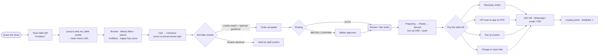
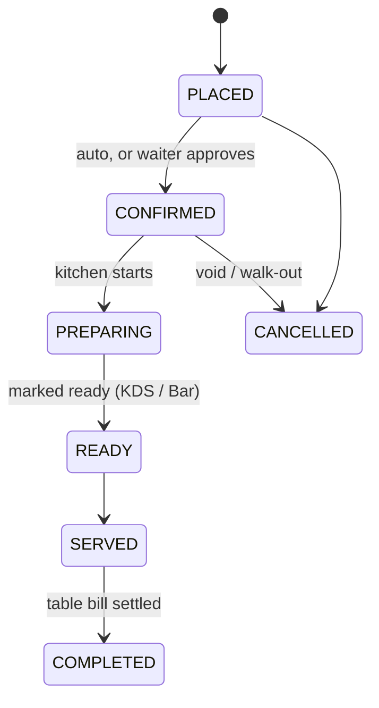
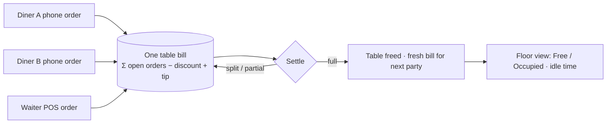
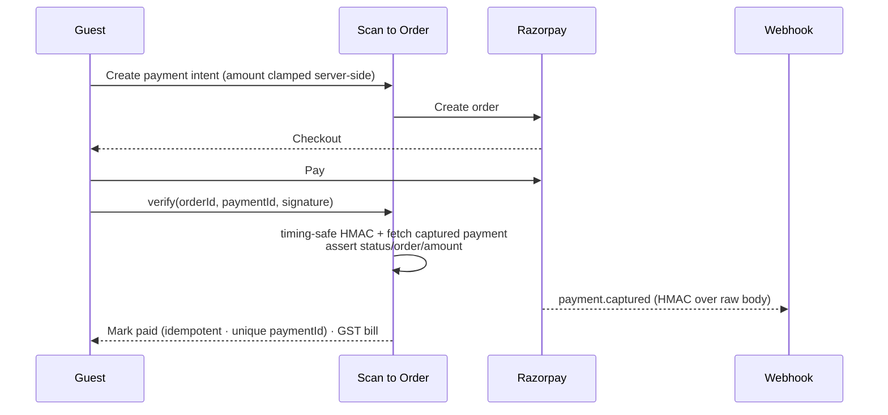
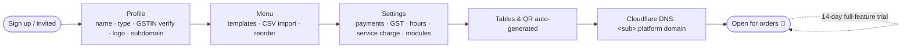
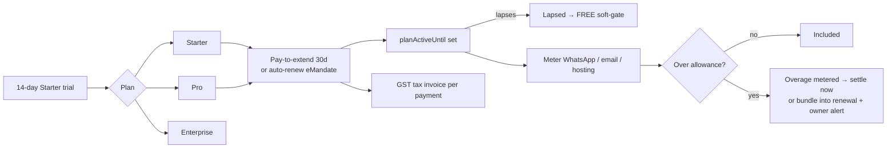

# Scan to Order — Restaurant Management SaaS

A multi-tenant, QR-based dine-in ordering platform for restaurants, cafés, bars,
cloud kitchens and hotels. Diners scan a table's QR code, browse the menu and
order from their phone; orders flow live to a kitchen/bar screen; rounds roll up
into a single consolidated bill the diner can pay by UPI, online card/UPI
(Razorpay), at the counter, or charge to their hotel room. Restaurants run
everything — menu, orders, billing, inventory, reservations, rooms, banquets,
staff, analytics — from one admin dashboard, with a self-serve onboarding wizard
and per-venue feature modules.

Billing is **table-based**: every unpaid order at a table — across all the
diners' phones and any waiter POS orders — rolls into one consolidated bill, and
staff turn the table over from a live **Floor** view. Fake/off-site orders are
blocked by a scan-session cookie + optional geofence, and staff actions are
attributed and audited.

Built with **Next.js 16** (App Router, Turbopack), **PostgreSQL + Prisma 7**
(driver adapter), **Tailwind v4**, **Razorpay** (online payments + subscriptions),
**Meta WhatsApp Cloud API** (WhatsApp) + **2Factor** (SMS OTP fallback), **Resend** (email),
**Cloudflare R2** (image/CDN storage) + **Cloudflare DNS** (per-venue subdomain
automation), **Web Push (VAPID)**, optional **Redis** (scale-out realtime + rate
limiting), and a **Vitest** suite. The platform is multi-tenant end-to-end: a
**super-admin console** runs subscriptions, revenue, operators/RBAC, feature
flags, dunning and support across every tenant, and the app ships a hardened
security baseline (password + 2FA for operators, encrypted secrets at rest,
constant-time signature checks, an enforcing CSP, and fail-closed rate limits).

---

## Table of contents

1. [Overview & value proposition](#overview--value-proposition)
2. [Actors](#actors)
3. [Application flows](#application-flows)
4. [Features](#features)
5. [Security & compliance](#security--compliance)
6. [Tech stack](#tech-stack)
7. [Prisma 7 driver-adapter setup](#prisma-7-driver-adapter-setup)
8. [Local setup](#local-setup)
9. [Demo logins & seed data](#demo-logins--seed-data)
10. [Testing on other devices (LAN / PWA / push)](#testing-on-other-devices-lan--pwa--push)
11. [Project structure](#project-structure)
12. [Scripts](#scripts)
13. [Testing](#testing)
14. [Environment variables](#environment-variables)
15. [Deployment notes](#deployment-notes)
16. [Further docs](#further-docs)

---

## Overview & value proposition

Scan to Order is a single SaaS that a venue signs up for, onboards in a few
minutes, and immediately starts taking contactless orders. Each tenant
(restaurant) gets:

- A public ordering surface reachable via a chosen **username/subdomain**
  (`spicegarden.scan.to`) or path (`/spicegarden/T1`), one QR per table.
- An **admin dashboard** whose navigation adapts to the operator's **role** and
  the venue's enabled **feature modules** (reservations, hotel rooms, banquets,
  bar).
- Runtime behaviour driven by an `OnboardingConfig` record — order routing,
  payment timing, payment methods, GST, languages, happy hour, KOT printer.

A **super-admin** console oversees all tenants and their subscription plans.

---

## Actors

| Actor | Where | What they do |
|-------|-------|--------------|
| **Admin / Restaurant** | `/admin/**` | Onboard, manage menu/tables/QR, confirm & track orders, **floor/table turnover**, billing, coupons, inventory, reservations, rooms, banquets, multi-property, integrations, **staff & attendance**, analytics, export, audit, settings. Owners sign in with email at `/signin`; staff sign in with a **username** at their restaurant's link (`spicegarden.scan.to/signin`, dev path `/r/<code>/signin`) |
| **Customer / Diner** | `/menu` → `/cart` → `/checkout` → `/order/[id]` → `/payment?order=[id]`, plus `/account`, `/book/[slug]`, `/banquet/[slug]` (entered via the QR's `/[tenant]/[table]` → `/t/[token]`) | Scan → browse → cart → checkout → order → track live status → pay (UPI/online/counter/room); leave feedback; book a table; enquire about a banquet |
| **Kitchen + Bar screens** | `/admin/kitchen`, `/admin/monitor`, `/admin/kot/[orderId]` | Live order queue with status controls; customer-facing "Preparing / Ready" board; printable 80mm KOT (kitchen/bar station split) |
| **Super-admin / platform operator** | `/superadmin` | Run the business across all tenants: revenue/MRR dashboard, per-tenant drill-down + lifecycle (grant plan, suspend, impersonate, notes), growth/funnel, health, dunning, promo codes, feature flags/kill-switches, announcements, domains/DNS, retention/churn, operator onboarding & invites. Gated by `AdminUser.isSuperAdmin`, sub-scoped by platform role (FULL / BILLING / SUPPORT), and protected by **2FA** (email OTP and/or authenticator TOTP) |

The admin dashboard scopes itself per role — see the
[RBAC table in ARCHITECTURE.md](docs/ARCHITECTURE.md#rbac--permission-model).
A Kitchen user lands on the kitchen screen; a Cashier/Waiter on orders; an Owner
sees everything including Staff and Properties. The platform console is **never**
visible to restaurant accounts, and every operator lifecycle action is written to
a `PlatformAuditLog`.

---

## Application flows

End-to-end journeys for each actor. Diagrams render on GitHub and in any
Mermaid-aware viewer. A wider visual set lives in
[docs/flows.md](docs/flows.md); architecture-level sequence diagrams are in
[docs/ARCHITECTURE.md](docs/ARCHITECTURE.md).

### 1. Diner — scan → order → track → pay



### 2. Order lifecycle (staff view)



### 3. Table-based billing & floor turnover



### 4. Online payment & settlement (Razorpay)



### 5. Owner onboarding (live in minutes)



### 6. Tenant subscription, usage & overage billing



### 7. Platform operator console

```mermaid
flowchart TD
    Op([Operator sign-in]) --> MFA[Password + 2FA<br/>email OTP / authenticator TOTP]
    MFA --> Console[/superadmin]
    Console --> Rev[Revenue · MRR · funnel · health]
    Console --> Ten[Tenant drill-down]
    Ten --> Life[Grant plan · suspend · impersonate · notes]
    Console --> Ops[Dunning · promos · flags · announcements · domains · retention]
    Console --> Onb[Operator roles RBAC · invite tenants]
    Life & Ops & Onb --> Log[(PlatformAuditLog)]
```

---

## Features

### Ordering
- QR-per-table scan → mobile menu with categories, veg/non-veg, chef specials,
  special-of-day, item images, modifiers/variants (single- & multi-select), and
  per-item daily availability windows (e.g. breakfast 7–11 AM).
- **App-like menu**: a sticky **left category rail** with icons + scroll-spy,
  dietary filter chips, and a bottom tab bar (Menu / My Orders).
- **Clean diner URLs**: the QR resolves to `/t/<token>`, which `proxy.ts`
  (middleware) turns into a cookie + redirect so the address bar shows the clean
  funnel **`/menu` → `/cart` → `/checkout`**, then **`/order/[id]`** and
  **`/payment?order=[id]`** (the opaque token never appears; old
  `/order/[id]/bill` redirects to `/payment`). Diner pages read the table from the
  `sto_table` cookie (`src/lib/table-session.ts`).
- Cart + checkout; prices and availability **re-validated server-side** (never
  trusted from the client). The cart + dining session persist per **restaurant**
  in `localStorage`, so they follow the diner if they move tables.
- **Anti-fake-order**: an order is only accepted from a device that actually
  scanned the table QR (the `sto_table` cookie must match), so a leaked token
  can't be replayed. Per-table **rate limiting** (Redis or in-memory) dedups
  double-submits and caps bursts. Optionally (per venue) the diner must be at the
  **venue location** (geofence): on-site → accepted; clearly remote → blocked;
  location declined → the order is **held for staff confirmation** (privacy-safe).
  Only a presence flag + rounded distance are stored — never exact coordinates.
- Order routing per config: **AUTO** (straight to kitchen) or **WAITER_CONFIRM**.
- Live order status to the diner (Placed → Confirmed → Preparing → Ready →
  Served → Completed) over SSE + optional push.
- Diner-initiated **service requests** (call waiter, water, bill, clean table).
- **Menu admin**: search/filter the item list, bulk enable/disable or bulk
  price-adjust-by-percentage a selection, per-category **Hide/Show** (hidden
  categories drop out of the live diner menu), CSV import/export, drag-free
  reorder, and a **"Preview live menu"** link straight to the venue's ordering
  URL.

### Staff orders (POS) & order editing
- Waiters create orders on a guest's behalf at **`/admin/orders/new`** (table
  picker + searchable item grid + ticket).
- On any **open, unpaid** order's detail page, staff add / remove items and change
  quantities inline — totals and stock **recompute automatically**
  (`src/lib/orders/staff-actions.ts`). Paid/cancelled orders are read-only.
- **Order history**: `/admin/orders/history` + per-order detail with timeline.

### Table-based billing & floor turnover
- The bill is **per table**: every open (non-cancelled, unpaid) order at a table
  consolidates into one payable — across multiple diners' phones **and** waiter
  POS orders. Pay once and the whole table settles; the next party starts a fresh
  bill. The earliest ("primary") order carries the tip, coupon/discount and
  running `amountPaid` (others settle at 0, so the total paid is accurate).
- Consolidated payable = `total of all open orders − discount + tip`. Supports
  **split / partial** payments — split evenly by headcount, or **split by
  person** (items grouped by who ordered them, via `OrderItem.splitLabel`) —
  each share still paid through the same Razorpay flow as a full bill.
- **Table moves**: a diner who re-scans a different table has their open orders
  auto-migrated to it (cart follows automatically); waiters can also move an order
  or a whole party between tables from the order detail.
- **Floor view** (`/admin/floor`): a live grid of every table as **Free** or
  **Occupied** (occupied = has an open bill, with total + idle time). One tap
  frees a table for the next party — **Settle & free** (records payment) or
  **Void & free** (cancels as a walk-out, confirm-gated). Occupancy is derived
  from open orders (no separate state).

### Order attribution
- Every order records **who placed it** and **how**: QR self-order vs. staff/POS
  (with the staff member's name), shown on the orders board and detail. Staff item
  edits and table moves are written to the audit log.

### Payments
- **UPI scan-to-pay** — a `upi://pay` QR (payee VPA + amount pre-filled) embedded
  on the 80mm PDF bill (`src/lib/upi.ts`).
- **Razorpay** — online card/UPI checkout; per-restaurant keys with platform-env
  fallback; HMAC signature verification; idempotent re-verify.
- **Pay at counter** — staff mark the session paid (`COUNTER`).
- **Charge to room** — hotel in-room dining posts the session to the room folio
  (`ROOM`), settled by the front desk at checkout.
- A **mock** online-payment path keeps the flow demoable in development when no
  Razorpay keys are set (disabled in production).

### KOT / kitchen printing
- ESC/POS Kitchen Order Tickets over TCP (network thermal printer, default
  `:9100`) and an 80mm PDF KOT view.
- Categories carry a **station** (`KITCHEN` or `BAR`) so bar items can route to a
  separate counter/KDS.

### Bills
- 80mm thermal-style **PDF** via `pdfkit` (`/api/bill/[orderId]/pdf`) with GST
  break-up, discount, tip, and the UPI QR.
- **WhatsApp bill delivery** gated by phone + OTP (Meta WhatsApp Cloud API, or console-logged in
  dev).

### Multi-language menu
- Base English plus optional per-item translations. Supported codes: en, hi, ta,
  te, kn, ml, bn, mr (`src/lib/languages.ts`).

### Loyalty
- Points credited once per paid order (1 point per ₹10), keyed to the
  phone-identified `Customer`; idempotent via `Order.pointsAwarded`.

### Coupons & happy hour
- Percentage / flat coupons with min-order, max-discount cap, usage limits.
- Automatic happy-hour % discount during a configured daily window.

### Inventory
- Per-item stock tracking: auto-hide at 0, decrement on order, low-stock
  threshold alerts.

### Reservations
- Table bookings + walk-in waitlist with status lifecycle (Pending → Confirmed →
  Seated / Cancelled / No-show). Public booking page at `/book/[slug]`.
- Waitlist entries show a **queue position (#N)** on the admin cards; a guest
  who joins gets a public, auto-refreshing **live-position page**
  (`/book/[slug]/waitlist/[id]`) linked from their booking confirmation.

### Hotel rooms & banquets
- **Rooms**: tables of kind `ROOM` for in-room dining; charge-to-room folio
  settled at checkout (`/admin/rooms`).
- **Banquets**: event/function-hall bookings with pre-agreed menu lines and an
  optional advance deposit; public enquiry page `/banquet/[slug]`.

### Multi-property
- A `PropertyGroup` lets one owner manage several outlets under one login and
  switch the active property (`/admin/properties`).

### Integrations & webhooks
- A provider catalog (POS / PMS / Accounting / SSO / Webhook). **Outbound
  webhooks fire live** on order events (SSRF-guarded, best-effort, 5s timeout,
  optional `X-STO-Secret`); other connectors are configurable scaffolding.

### Staff accounts & login
- Owners are created with an **email**; staff are assigned a **username** (no
  email needed) — unique within the restaurant — and sign in at the restaurant's
  link (`<sub>.<domain>/signin`; dev path `/r/<code>/signin`). Owner email login
  stays at `/signin`.
- Owners can **reset a staff password** and **disable/enable** an account
  (disabled accounts are rejected immediately — guards re-check the DB each
  request, so it doesn't wait for the JWT to expire). Role changes apply live too.

### Attendance (optional module)
- Staff **clock in/out** from a header widget; managers see who's on shift and can
  mark or correct times (`/admin/attendance`). Self clock-in is **geofenced** to
  the venue (configurable radius); GPS is stored as a flag + coords for the punch.
- A **per-staff performance** summary (orders taken, items, sales) sits on
  Analytics, using the order attribution above.

### Per-venue modules
- Each venue enables only what it uses — **Reservations, Rooms, Banquets, Bar,
  Attendance**, and a **"require diners at the venue"** geofence toggle —
  defaulted from the venue **type** at onboarding (Hotel → rooms + banquets, Bar →
  bar, dine-in → require-location on, etc.) and toggled in **Settings → Modules**.
  Disabled modules are hidden from the admin nav. The venue's geofence
  **latitude/longitude + radius** are captured in Settings (used by both
  attendance and diner presence checks).

### Bar counter (KDS)
- `/admin/bar` — a read-only prep board of **Bar-station** drink items across open
  orders. Categories are tagged `KITCHEN` or `BAR` in the menu editor. Shown only
  when the Bar module is on.

### Notifications
- `/admin/notifications` + a **header bell with a count badge** — a unified feed
  (new orders, service calls, low stock, pending reservations, event enquiries),
  derived from live data. The badge **clears once you open the page** (tracked via
  the `sto_notif_seen` cookie).

### Analytics
- `/admin/analytics` with **time-range presets** (1d / 7d / 30d / 60d / 180d /
  365d), metric cards (orders, revenue, avg order, items sold, unique / new /
  returning guests, GST) with **vs-previous-period deltas**, a bucketed revenue
  trend, peak hours, and top-selling items.

### Tenant subscription billing & plans
- Subscription tiers **FREE / STARTER / PRO / ENTERPRISE** (`src/lib/plans.ts`,
  capability gates in `src/lib/capabilities.ts`). A **14-day full-feature Starter
  trial** on signup; after that, owners **pay-to-extend** (30-day periods) or set
  up **auto-renew** via Razorpay Subscriptions / eMandate.
- `planActiveUntil` + `subscriptionState` derive an **effective tier**; a lapsed
  plan **soft-gates down to FREE** rather than locking the venue out. Checkout +
  webhook reconcile live in `/admin/billing`.
- **Metered usage & overage**: WhatsApp / email / hosting usage is metered against
  the plan allowance; overage is priced and can be **settled now or bundled into
  the next renewal**, with **owner notifications** (email / WhatsApp / web push,
  incl. Meta templates) when a threshold is crossed or a settlement succeeds.
- A **GST tax invoice** PDF is generated per plan payment (platform legal name /
  GSTIN / address from env), with the verified tenant legal name on diner bills.

### Customer CRM & WhatsApp campaigns
- A per-tenant guest list (built from phone-identified `Customer` + order history)
  with **segments** (all / repeat / recent). Owners send **WhatsApp campaign
  blasts** to a segment (`src/lib/campaigns/actions.ts`) — metered per recipient,
  capped per blast and **rate-limited per venue per day**.

### Reporting
- **Z-report** (end-of-day sales summary: orders, revenue, GST, payment-method
  split, top items) and a scheduled **daily summary email** to the owner
  (`src/lib/reports/daily.ts`, driven by the `daily-summary` cron).

### Service charge & dietary
- Optional **service charge %** applied to the bill alongside GST, tips and
  coupons (consistent across the payment page, settlement and PDF).
- Diner-facing **dietary filter chips** (veg / vegan / gluten-free) and **menu
  search**, plus post-meal **feedback** capture.

### GST verification
- Optional **GSTIN verification** (Sandbox API) on onboarding fetches the
  registered **legal name** into `OnboardingConfig` (`gstLegalName` / `gstVerified`),
  surfaced on the tax invoice. Fail-soft: unconfigured/down still lets tenants
  save an unverified GSTIN.

### Admin internationalization (i18n)
- All admin screens are translatable via a dependency-free dictionary
  (`src/lib/i18n-screens.ts`), shipping **English, Hindi and Kannada**; a locale
  switcher in the admin chrome. (Diner menus also carry per-item translations —
  see [Multi-language menu](#multi-language-menu) above.)

### Platform operator console
- **`/superadmin`** (gated by `isSuperAdmin`, **hidden from restaurant accounts**;
  on the apex domain `<PLATFORM_DOMAIN>/admin` redirects an operator straight to
  the console): revenue/**MRR** dashboard, growth/funnel + health, per-tenant
  drill-down with **lifecycle** (grant plan, suspend, impersonate, notes),
  **dunning**, **promo codes**, **feature flags / kill-switches**,
  **announcements**, **domains/DNS**, **retention/churn-risk + win-back**, and
  **operator onboarding / tenant invites**.
- Operators are **RBAC sub-scoped** (FULL / BILLING / SUPPORT via `platformCan`),
  protected by **2FA** (email OTP and/or authenticator TOTP — either satisfies the
  step), and every lifecycle action is written to a **`PlatformAuditLog`**.

### PWA & push
- Installable PWA (`src/app/manifest.ts`, `public/sw.js`, offline fallback at
  `/offline`).
- Web Push (VAPID): restaurants get a push on every new order; diners get one
  when their order is confirmed/ready. Requires VAPID keys + a secure context.

### Auditing
- Sensitive admin actions are written to an audit log (`/admin/audit`); platform
  operator actions to a separate `PlatformAuditLog`.

---

## Security & compliance

The app ships a hardened baseline (full audit + remediation in
[docs/security-audit.md](docs/security-audit.md)):

- **AuthN/Z** — `jose` HS256 session JWTs (secret enforced ≥32 bytes); guards
  re-check the DB each request (disable/role changes apply live); bcrypt-hashed
  OTPs with TTL + attempt caps. Super-admin login is **password + 2FA**, where the
  OTP step is bound to a short-lived signed token (it never trusts a client-supplied
  email), and TOTP codes are single-use (replay-guarded).
- **Payments** — all Razorpay checkout / webhook / subscription signatures use
  **constant-time HMAC**; verify paths **re-fetch the captured payment** and assert
  status/order/amount; `razorpayPaymentId` is unique (replay-proof); dev mock-billing
  paths are disabled in production.
- **Multi-tenant isolation** — every admin mutation re-authorizes and scopes Prisma
  by the session's `restaurantId`; ownership checks on export/invoice/upload/category.
- **Secrets at rest** — per-tenant Razorpay secrets and TOTP secrets are
  **AES-256-GCM encrypted** (`ENCRYPTION_KEY`).
- **Injection/SSRF/uploads** — all email templates HTML-escape tenant data;
  outbound fetches (logo, webhooks) are SSRF-guarded; uploads are **magic-byte
  sniffed** with a pinned content-type; `qrToken` is CSPRNG.
- **HTTP hardening** — **enforcing CSP**, HSTS, `X-Frame-Options`,
  `X-Content-Type-Options`, `Referrer-Policy`, `Permissions-Policy`; cron endpoints
  are header-only Bearer + constant-time; auth rate limiters **fail closed**.

---

## Tech stack

| Layer | Choice |
|-------|--------|
| Framework | Next.js 16 (App Router, Server Actions, Turbopack) |
| Language | TypeScript, React 19 |
| Database | PostgreSQL |
| ORM | Prisma 7 via `@prisma/adapter-pg` driver adapter (+ `pg`) |
| Styling | Tailwind CSS v4 (`@tailwindcss/postcss`); **shadcn/ui** (Button/Card/Badge/Separator) scoped to the marketing site (`src/components/ui/*`) and remapped onto the brand palette — the product/admin UI kit (`src/components/ui.tsx`) is separate and unstyled by shadcn |
| Auth | `jose` JWT session cookie + `bcryptjs`; 2FA via email OTP + dependency-free TOTP (RFC 6238) |
| Crypto | `node:crypto` — AES-256-GCM secret encryption, constant-time HMAC, CSPRNG tokens |
| Payments | Razorpay (orders, webhooks, subscriptions/eMandate); UPI deep links |
| Messaging | **Meta WhatsApp Cloud API** (WhatsApp) + **2Factor** (SMS OTP fallback); console fallback |
| Email | **Resend** |
| Storage / CDN | **Cloudflare R2** (S3-compatible via `aws4fetch`) for images |
| DNS | **Cloudflare DNS** — per-venue subdomain automation |
| Push | `web-push` (VAPID) |
| PDF / QR | `pdfkit`, `qrcode` |
| Validation | `zod` |
| Icons | `lucide-react` |
| i18n | dependency-free dictionary (en / hi / kn) |
| Observability | optional **Sentry** forwarder; ops alerting (email / Slack webhook) |
| Realtime / rate-limit | in-memory by default; **`ioredis`** (Redis pub/sub + counters) when `REDIS_URL` is set |
| Tests | **Vitest** (`npm test`) + **Playwright** e2e (`npm run test:e2e`) |

> **This is Next.js 16** — APIs and conventions differ from older versions
> (async `cookies()`/`params`, `images.remotePatterns`, `serverExternalPackages`,
> Turbopack by default). Read `node_modules/next/dist/docs/` before changing
> framework-level code.

---

## Prisma 7 driver-adapter setup

Prisma 7 connects through a **driver adapter** rather than a datasource URL:

- `prisma/schema.prisma` declares `provider = "postgresql"` with **no inline
  `url`** — the runtime URL comes from the adapter.
- `src/lib/db.ts` builds a `PrismaClient` with `new PrismaPg({ connectionString:
  process.env.DATABASE_URL })`, reused across hot reloads.
- `prisma.config.ts` supplies `DATABASE_URL` to the migrate/introspect CLIs and
  calls `process.loadEnvFile()` (Prisma 7 config files do **not** auto-load
  `.env`).
- `serverExternalPackages` in `next.config.ts` keeps `@prisma/adapter-pg`, `pg`,
  `pdfkit`, `razorpay`, `web-push` and `ioredis` out of the Turbopack
  bundle.

---

## Local setup

### 1. Prerequisites
- Node.js 20.9+ (the repo is developed on Node 20+; `process.loadEnvFile`
  requires 20.6+).
- A reachable **PostgreSQL** database (locally, e.g. `brew install postgresql@18`,
  then create a database such as `scan_to_order`).

### 2. Environment
```bash
cp .env.example .env
```
Set at least `DATABASE_URL` and `AUTH_SECRET`. Without Razorpay/WhatsApp/VAPID, the
app runs in a fully testable **dev/console mode**: online payments are mocked,
OTP/WhatsApp messages are printed to the server console, and push is a no-op.

### 3. Database
The schema has evolved via `prisma db push` (no migration history is committed),
so for local dev:
```bash
npm run db:generate    # prisma generate (also runs on postinstall)
npm run db:push        # push schema -> database (no migrations)
npm run db:seed        # optional demo data (tsx prisma/seed.ts)
```
`npm run db:migrate` (`prisma migrate dev`) is also wired up if you choose to
adopt migrations — see [Deployment notes](#deployment-notes).

### 4. Run
```bash
npm run dev            # http://localhost:3000 (binds 0.0.0.0:3000)
```

---

## Demo logins & seed data

`npm run db:seed` creates the **"Spice Garden (Demo)"** restaurant (slug
`spice-garden-demo`, subdomain `spicegarden`) with menu, tables, stock, coupons
and sample orders. Config: `WAITER_CONFIRM` routing, `PAY_AFTER`, online + counter
payments on, GST `EXCLUSIVE` 5%, happy hour 16:00–19:00 (20% off), languages
`en,kn,hi`.

All demo accounts use password **`password123`**:

| Login | Username | Role | Lands on |
|-------|----------|------|----------|
| `demo@scan.to` (email) | — | Owner | `/admin` (full access incl. Staff, Properties, Settings) |
| `manager@scan.to` (email) | `manager` | Manager | `/admin` (all except Staff & Properties) |
| `cashier@scan.to` (email) | `cashier` | Cashier | `/admin/orders` |
| `waiter@scan.to` (email) | `waiter` | Waiter | `/admin/orders` |
| `kitchen@scan.to` (email) | `kitchen` | Kitchen | `/admin/kitchen` |

Owners sign in by email at `/signin`. Staff can also sign in by **username** at
the restaurant's link — locally `http://localhost:3000/r/spicegarden/signin` (in
production `spicegarden.<PLATFORM_DOMAIN>/signin`).

To try the **customer** flow, open `/admin/tables` and open/scan any table QR (or
visit its URL).

> The demo config also seeds a **venue location** (Bengaluru) with
> `featureAttendance` on and `requireDinerLocation` on, so attendance clock-in and
> the diner geofence are demoable. Geofenced clock-in/order needs a secure context
> (use `npm run dev:lan` on a phone, or test the server logic directly).

> **Notes on the seed:**
> - The demo owner (`demo@scan.to`) is seeded with `isSuperAdmin = true` (so
>   `/superadmin` works out of the box) and a demo **UPI ID** (`spicegarden@oksbi`)
>   plus all per-venue modules enabled. For a real deployment, make **your own**
>   account the super-admin and keep restaurant-owner accounts non-super.

---

## Testing on other devices (LAN / PWA / push)

Service workers, install and push require a **secure context** (localhost or
HTTPS). To test on a phone over your network:

```bash
npm run dev:lan        # binds 0.0.0.0:3000 with a self-signed HTTPS cert
```

The `dev`/`dev:lan` scripts run `scripts/lan-url.mjs` to detect your LAN URL. Set
`NEXT_PUBLIC_APP_URL` to that URL (e.g. `https://10.0.0.243:3000`) so table QR
codes resolve on other devices (find your IP via `ipconfig getifaddr en0`). Accept
the certificate warning on the device. `next.config.ts` already trusts localhost,
this machine's IPs, and private LAN ranges as dev origins.

---

## Project structure

```
src/
  app/
    page.tsx                 Marketing / landing page
    (auth)/signin, signup    Owner email auth
    (auth)/r/[code]/signin   Restaurant-scoped staff (username) sign in
    onboarding/              Setup wizard (profile → menu → settings → tables → done)
    admin/                   Admin dashboard (nav + mobile hamburger + layout chrome)
      orders/ (+ new [POS], history [paginated], [orderId] editor + change-table)
      floor/                 Live table-occupancy view (Free/Occupied, free table)
      kitchen/  bar/  monitor/   Kitchen, bar (KDS) + customer-facing board
      kot/[orderId]/         Printable 80mm KOT
      notifications/         Unified alert feed
      menu/  coupons/  inventory/
      tables/                Tables & QR
      reservations/  rooms/  banquets/
      feedback/  analytics/  export/  audit/ [paginated]
      staff/  attendance/  properties/  integrations/  billing/  settings/
    superadmin/              Platform console: billing/MRR, restaurants (drill-down +
                             lifecycle), growth, health, operators, flags, promos,
                             announcements, domains, retention, audit, onboard, security
    (auth)/set-password/     Invite set-password flow (token-based)
    menu/  cart/  checkout/  Diner ordering funnel (clean URLs; table from cookie)
    order/[orderId]/         Diner status (/bill redirects to /payment)
    payment/                 Consolidated bill + pay (?order=<id>)
    t/[qrToken]/             QR entry → sets cookie, redirects to /menu (via proxy.ts)
    [tenant]/[table]/        Subdomain/path-based table entry
    account/                 Diner account (loyalty/history)
    book/[slug]/  banquet/[slug]/   Public reservation + event-enquiry pages
    offline/                 PWA offline fallback
    manifest.ts              PWA manifest
    api/
      realtime/              SSE event stream
      bill/[orderId]/pdf/    80mm PDF bill
      export/[type]/         CSV export
  components/
    diner/                   customer-menu, cart-view, checkout-form, bill-client,
                             controls, tab-bar, scan-prompt, use-cart
    admin/                   clock-widget, mobile-nav, pager, free-table
  lib/
    auth/                    session (jose JWT), guards (+ live disable/role), permissions, password
    onboarding/              actions + step order
    orders/  customer/       order placement, status, table moves, cart helpers, menu-context
    billing/                 table-bill settle, consolidated bill, PDF
    payments/                Razorpay (resolve creds, create order, verify sig)
    attendance/              clock-in/out + manager mark (geofenced)
    redis.ts  ratelimit.ts   optional Redis client + sliding-window rate limiter
    upi.ts                   UPI deep-link builder
    messaging/               OTP + WhatsApp/SMS provider (Meta | 2Factor | console)
    print/                   KOT ESC/POS + print action
    realtime/                SSE event bus (in-memory, or Redis pub/sub when REDIS_URL set)
    integrations/            catalog, actions, outbound webhooks
    platform/                operator actions, roles (RBAC), feature flags, alerts
    plans.ts  capabilities.ts  plan-settings.ts   plan tiers + capability gating
    campaigns/  reports/       WhatsApp CRM blasts + Z-report/daily summary
    crypto.ts  cron-auth.ts    AES-256-GCM secrets + constant-time cron auth
    storage/r2.ts  cloudflare.ts  gst.ts   R2 uploads + DNS automation + GSTIN verify
    i18n-screens.ts  i18n.ts  i18n-actions.ts   admin i18n (en/hi/kn)
    properties/  tenant/     multi-outlet + subdomain resolution
    loyalty.ts  coupons/  inventory/  reservations/  rooms/  banquets/  feedback/
    pricing.ts               totals + GST + service charge + happy hour + round2
    languages.ts  templates.ts  qr.ts  subdomain.ts  push.ts  audit.ts  usage.ts  env.ts  db.ts
  proxy.ts                   Subdomain → /[tenant] + staff /signin rewrite (middleware)
prisma/  schema.prisma  seed.ts
public/  sw.js  icons/
vitest.config.ts  src/**/*.test.ts   Vitest config + unit/integration tests
```

---

## Scripts

| Command | Purpose |
|---------|---------|
| `npm run dev` | Dev server (`0.0.0.0:3000`) |
| `npm run dev:lan` | Dev server over self-signed HTTPS (for phones/PWA) |
| `npm run build` | `prisma generate` + `next build` |
| `npm run start` | Serve the production build |
| `npm run lint` | ESLint |
| `npm test` | Run the Vitest unit suite once |
| `npm run test:watch` | Vitest in watch mode |
| `npm run db:generate` | `prisma generate` |
| `npm run db:push` | Push schema to the DB (no migrations) |
| `npm run db:migrate` | `prisma migrate dev` |
| `npm run db:studio` | Prisma Studio |
| `npm run db:seed` | Seed demo data (`tsx prisma/seed.ts`) |

---

## Testing

`npm test` runs the **Vitest** suite (`*.test.ts` under `src/`). It covers the
highest-risk **pure logic** with no DB needed:

- `pricing` (GST modes + rounding), `auth/permissions` (RBAC + landing routes),
  `customer/cart` (line keys, option pricing, subtotals), `utils`
  (geofence distance, durations, availability windows, happy hour, `escapeHtml`),
  `validation` schemas, `subdomain`, `plans`/`subscription` tiering, refund math,
  and the `ratelimit` sliding window.
- **Security paths**: constant-time HMAC + Razorpay signature verifiers
  (`payments/razorpay`), header-only cron auth (`cron-auth`), the password-bound
  MFA token (`auth/session`), and the TOTP RFC-6238 vector + replay guard
  (`auth/totp`).
- `redis.integration.test.ts` exercises the real Redis pub/sub + rate-limit paths
  and **auto-skips** when no Redis is reachable.
- Run e2e with `npm run test:e2e` (Playwright; seed first with `npm run db:seed:e2e`).

`vitest.config.ts` aliases `@ → src` and stubs `server-only` so server modules
import cleanly under Node. Server-action / DB integration tests are not included
yet (they need a throwaway test database).

---

## Environment variables

| Variable | Group | Purpose | Required? |
|----------|-------|---------|-----------|
| `DATABASE_URL` | Database | PostgreSQL connection string (used by the driver adapter and the Prisma CLI) | **Yes** |
| `AUTH_SECRET` | Auth | Secret used to sign admin session JWTs (`jose`). Use a long random string | **Yes** |
| `NEXT_PUBLIC_APP_URL` | Platform | Public base URL of the app; used to build QR/bill links. No trailing slash. Defaults to `http://localhost:3000` | No (recommended) |
| `NEXT_PUBLIC_PLATFORM_DOMAIN` | Platform | Apex domain for tenant subdomains (`<username>.<domain>`) and the subdomain rewrite middleware. Defaults to `scan.to` | No (set in prod) |
| `REDIS_URL` | Scale | When set, the realtime SSE bus and order rate limiter use Redis (pub/sub + counters) so they're correct across multiple instances. Unset → in-memory (single instance) | No (set to scale out) |
| `RAZORPAY_KEY_ID` | Payments | Platform-level Razorpay key id (fallback when a restaurant has no own keys) | No |
| `RAZORPAY_KEY_SECRET` | Payments | Platform-level Razorpay key secret | No |
| `NEXT_PUBLIC_RAZORPAY_KEY_ID` | Payments | Razorpay key id exposed to the browser checkout (same as `RAZORPAY_KEY_ID`) | No |
| `MESSAGING_PROVIDER` | Messaging | `meta` (WhatsApp Cloud API) for real delivery, `console` to log codes/messages in dev. Defaults to `console` | No |
| `META_WHATSAPP_TOKEN` / `META_WHATSAPP_PHONE_ID` | Messaging | Meta WhatsApp Cloud API token + sender phone-number id | Only if `meta` |
| `META_WHATSAPP_*_TEMPLATE` | Messaging | Names of pre-approved templates (OTP, bill, overage, dunning) | For business-initiated WA |
| `META_WHATSAPP_VERIFY_TOKEN` / `META_APP_SECRET` | Messaging | Inbound WhatsApp webhook verify token + app secret (24h free-window) | For the WA webhook |
| `SMS_FALLBACK_PROVIDER` / `TWOFACTOR_API_KEY` | Messaging | SMS OTP fallback via 2Factor (`twofactor` to enable) | Optional |
| `VAPID_PUBLIC_KEY` | Web Push | VAPID public key (server) | Only for push |
| `VAPID_PRIVATE_KEY` | Web Push | VAPID private key (server) | Only for push |
| `VAPID_SUBJECT` | Web Push | VAPID subject, e.g. `mailto:you@example.com` | Only for push |
| `NEXT_PUBLIC_VAPID_PUBLIC_KEY` | Web Push | VAPID public key exposed to the browser to subscribe | Only for push |
| `ENCRYPTION_KEY` | Security | AES-256-GCM key for encrypting secrets at rest (Razorpay/TOTP). Strongly recommended in prod — unset stores plaintext and logs a warning | Recommended |
| `RAZORPAY_WEBHOOK_SECRET` | Payments | Verifies the Razorpay webhook HMAC (raw body) | For webhooks |
| `RAZORPAY_PLAN_STARTER` / `_PRO` | Payments | Razorpay Subscription plan ids for auto-renew/eMandate | For auto-renew |
| `CRON_SECRET` | Ops | Bearer token for the `/api/cron/*` endpoints (header-only) | For cron jobs |
| `SUPERADMIN_2FA` | Security | Enable 2FA enforcement for platform operators | No |
| `RESEND_API_KEY` / `EMAIL_FROM` | Email | Resend API key + default sender for bills/invoices/reports | For email |
| `META_WHATSAPP_*` | Messaging | Meta WhatsApp Cloud API token / phone id / approved templates (set `MESSAGING_PROVIDER=meta`) | For Meta WA |
| `R2_*` | Storage | Cloudflare R2 account/keys/bucket + public base URL for menu/logo images | For uploads |
| `CLOUDFLARE_API_TOKEN` / `_ZONE_ID` / `_DNS_TARGET` | DNS | Per-venue subdomain DNS automation | For subdomains |
| `SANDBOX_API_KEY` / `_SECRET` | GST | GSTIN verification (Sandbox API) | For GST verify |
| `PLATFORM_*` | Billing | Platform legal name / GSTIN / address / billing email on tax invoices | For invoices |
| `OPS_ALERT_EMAIL` / `OPS_SLACK_WEBHOOK` | Ops | Destinations for ops alerting / digests | No |
| `SENTRY_DSN` | Observability | Enables the server-side error forwarder | No |
| `NODE_ENV` | Runtime | Standard Node/Next env; gates dev-only mock-payment paths and Prisma logging | Set by tooling |

> **Full reference:** every key, what it's for, and how to obtain it is documented
> in **[docs/environment.md](docs/environment.md)**, mirrored by
> **[.env.example](.env.example)**. The table above is the high-frequency subset.

Generate VAPID keys with `npx web-push generate-vapid-keys`. Per-restaurant
Razorpay keys, UPI VPA, and WhatsApp sender can also be set in **Settings →
Payment & messaging**, overriding the platform env.

---

## Deployment notes

- **Schema / migration drift caveat:** the schema has evolved via
  `prisma db push` and there is **no committed migration history**. For a fresh
  environment, `prisma db push` against an empty database is the supported path.
  If you adopt `prisma migrate`, baseline carefully against an existing schema to
  avoid drift.
- **Scaling out (multi-instance / serverless):** set **`REDIS_URL`**. The realtime
  SSE bus (`src/lib/realtime/bus.ts`) and the order rate limiter
  (`src/lib/ratelimit.ts`) then use Redis pub/sub + counters so they stay correct
  across instances; unset, they use per-instance in-memory state (fine for a
  single instance). Both fall back gracefully on a Redis error.
- **Scheduled jobs:** point your scheduler (Railway Cron, GitHub Actions, etc.) at
  the `/api/cron/*` endpoints (`sweep`, `dunning`, `daily-summary`, `ops-digest`,
  `backfill-subdomains`, and `reset-demo` — nightly rebuild of the public demo
  tenant) with an `Authorization: Bearer $CRON_SECRET` header. The secret is
  **never** accepted via query string.
- **Server-only packages** (`pdfkit`, `pg`, `@prisma/adapter-pg`, `razorpay`,
  `web-push`, `ioredis`) are declared in `serverExternalPackages`; keep
  that in sync if you add native/server deps.
- **Secrets:** `.env` is git-ignored; set a high-entropy random `AUTH_SECRET` in
  production (the dev value is a readable phrase). `DATABASE_URL`/`AUTH_SECRET` are
  required and throw at startup if missing; Razorpay/WhatsApp are optional and fail
  at use-time if only half-configured.
- **Secure context:** PWA install, push, and the diner geofence prompt require
  HTTPS in production (localhost is exempt in dev).
- Set production `NEXT_PUBLIC_APP_URL` and `NEXT_PUBLIC_PLATFORM_DOMAIN`, and run
  with `npm run build && npm run start`. See
  [docs/DEPLOYMENT.md](docs/DEPLOYMENT.md) for the full pre-deploy checklist.

---

## Further docs

- [docs/ARCHITECTURE.md](docs/ARCHITECTURE.md) — system architecture, order →
  bill → pay flow, KOT/realtime flow, RBAC model (with Mermaid diagrams).
- [docs/flows.md](docs/flows.md) — the full visual flow set (guest journey,
  service models, billing, multi-property, platform) in Mermaid.
- [docs/ONBOARDING.md](docs/ONBOARDING.md) — the setup wizard and per-venue
  feature defaults.
- [docs/environment.md](docs/environment.md) — every environment variable and how
  to obtain it (mirrored by [.env.example](.env.example)).
- [docs/security-audit.md](docs/security-audit.md) — the security audit + the
  remediation status of every finding.
- [docs/DEPLOYMENT.md](docs/DEPLOYMENT.md) — scaling (Redis), migration drift,
  secrets, observability, and the pre-deploy checklist.
- [docs/ops-backup.md](docs/ops-backup.md) — backup/restore & ops runbook.
- [docs/feature-catalog.md](docs/feature-catalog.md) — the complete owner-facing
  vs. operator-console feature catalog.
- [docs/pitch-deck.md](docs/pitch-deck.md) · [docs/proposal.md](docs/proposal.md)
  — sales/presentation material for venues.
