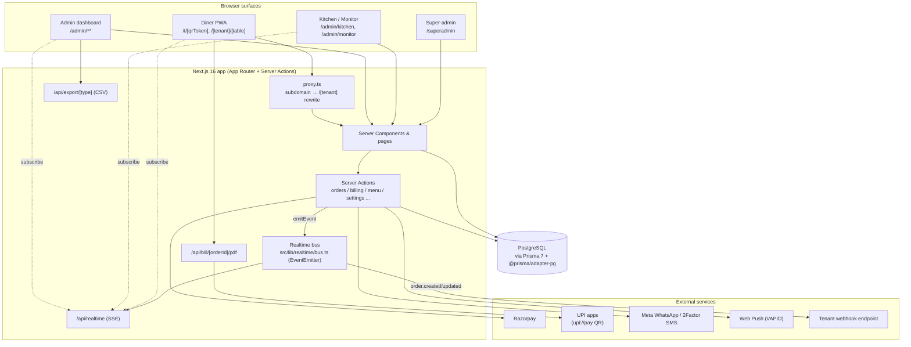
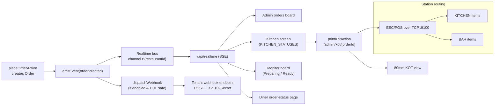

# Architecture

Scan2Order is a single Next.js 16 (App Router) application serving three
browser surfaces — the **diner** ordering app, the **admin** dashboard, and the
**kitchen/monitor** screens — plus a cross-tenant **super-admin** console. It is
backed by a single PostgreSQL database accessed through Prisma 7's `pg` driver
adapter. Live updates are pushed with Server-Sent Events from an in-process event
bus; external calls go to Razorpay (online payments), Meta WhatsApp / 2Factor SMS (OTP),
Web Push endpoints, and any configured outbound webhook.

---

## 1. High-level component diagram



**Walkthrough**

1. A diner reaches the ordering app either by a tokenised link `/t/[qrToken]` or
   via the venue subdomain `spicegarden.scan.to/T1`. `src/proxy.ts` rewrites the
   subdomain host's path to `/[tenant]/[table]`.
2. Pages are React Server Components reading directly from Postgres via Prisma;
   mutations go through **Server Actions** (e.g. `placeOrderAction`,
   `setOrderStatusAction`, billing/settle actions).
3. Every order mutation calls `emitEvent(...)` on the in-process **realtime bus**.
   SSE clients (admin orders board, kitchen, monitor, and the diner's order page)
   subscribe at `/api/realtime` and receive the event.
4. `emitEvent` also fans `order.created` / `order.updated` out to a tenant's
   configured **outbound webhook** (best-effort, SSRF-guarded).
5. Payments call Razorpay (order create + signature verify); the 80mm **PDF bill**
   (`/api/bill/[orderId]/pdf`) embeds a `upi://pay` QR. WhatsApp bills and OTP go
   through Meta WhatsApp (or the console in dev). Push notifications go to subscribed
   devices via VAPID.

---

## 2. Customer order → dining session → consolidated bill → pay

```mermaid
sequenceDiagram
    autonumber
    participant D as Diner (phone)
    participant A as Server Action
    participant DB as PostgreSQL
    participant B as Realtime bus → SSE
    participant K as Kitchen / Orders board
    participant RZP as Razorpay / UPI

    D->>A: placeOrderAction(qrToken, items, sessionId?)
    A->>DB: load table + restaurant + config (validate prices/stock)
    A->>DB: reuse or mint diningSessionId; inc orderSeq; create Order(+items)
    Note over A,DB: status = PLACED;<br/>AUTO → CONFIRMED, else WAITER_CONFIRM;<br/>tracked stock decremented
    A->>B: emitEvent(order.created)
    B-->>K: SSE order.created (new order appears)
    A-->>D: { orderId, orderNumber, sessionId, needsOnlinePayment }

    K->>A: confirm / advance status (PREPARING → READY → SERVED)
    A->>B: emitEvent(order.status / order.updated)
    B-->>D: SSE → live status; push on CONFIRMED & READY

    D->>D: order more rounds (same sessionId → same dining session)

    D->>A: request bill / open consolidated bill
    A->>DB: gather all non-cancelled orders in the session
    Note over A: payable = Σ round totals − discount(primary) + tip(primary)
    D->>A: applyCouponAction / setTipAction (locked once any payment made)

    alt Pay online (Razorpay)
        D->>A: createPaymentIntentAction(amount?)
        A->>RZP: create order (per-restaurant keys or platform env)
        A-->>D: razorpayOrderId + keyId
        D->>RZP: checkout
        D->>A: verifyPaymentAction(orderId, paymentId, signature)
        A->>A: verify HMAC; settled if amountPaid ≥ payable
    else Pay by UPI (scan-to-pay)
        D->>RZP: scan upi:// QR on the PDF bill, pay in any UPI app
        Note over D,A: staff confirm, then mark paid at counter
    else Pay at counter
        K->>A: markPaidAction (method COUNTER)
    else Charge to room (kind = ROOM)
        D->>A: chargeToRoomAction → orders PENDING / method ROOM
        Note over K: front desk settleRoomAction at checkout
    end

    A->>DB: settleSession → all orders PAID; award loyalty once each
    A->>B: emitEvent(order.updated)
```

**Walkthrough**

1. **Place order** — `placeOrderAction` (`src/lib/customer/actions.ts`) loads the
   table by `qrToken`, re-validates prices/availability against the DB, and
   resolves a **dining session**: if the client passes a `sessionId` the order
   joins it (inheriting the diner's name/phone), otherwise a new id is minted. The
   per-restaurant `orderSeq` is incremented in a transaction to assign
   `orderNumber`.
2. **Routing** — `AUTO` config sends the order straight to the kitchen
   (`CONFIRMED`); `WAITER_CONFIRM` leaves it `PLACED` until staff confirm. Tracked
   stock is decremented; an item hitting 0 auto-hides. `emitEvent(order.created)`
   notifies the boards and pushes to the restaurant.
3. **Kitchen progress** — staff advance status
   (`Confirmed → Preparing → Ready → Served → Completed`) via
   `setOrderStatusAction` (`src/lib/orders/actions.ts`), which timestamps each
   stage, emits an event, and pushes to the diner on `CONFIRMED` and `READY`.
4. **More rounds** — the diner can order again on the same `sessionId`; rounds
   accumulate into the same dining session.
5. **Consolidated bill** — `src/lib/billing/actions.ts` gathers every
   non-cancelled order in the session. The **primary** (earliest) order carries the
   `tipAmount`, `discountAmount`/`couponCode` and the running `amountPaid`. Payable
   = `Σ round totals − discount + tip`. Coupons and tips are locked once any
   payment is recorded.
6. **Pay** — four paths:
   - **Razorpay**: `createPaymentIntentAction` resolves per-restaurant keys (env
     fallback), creates a Razorpay order, records a `PENDING` `Payment`;
     `verifyPaymentAction` checks the HMAC signature, supports split payments, and
     calls `settleSession` once `amountPaid ≥ payable`. In dev with no keys, a
     mock path keeps the flow working.
   - **UPI scan-to-pay**: the PDF bill embeds a `upi://pay` QR (`src/lib/upi.ts`);
     staff then confirm/mark paid.
   - **Counter**: `markPaidAction` settles the session as `COUNTER`.
   - **Room**: `chargeToRoomAction` posts the session to the room folio
     (`PENDING`/`ROOM`); `settleRoomAction` (`src/lib/rooms/actions.ts`) settles all
     open room charges at checkout.
7. **Settle** — `settleSession` marks every order `PAID`, records `amountPaid`, and
   credits **loyalty** points once per order (idempotent via `pointsAwarded`).
   A **WhatsApp bill** can be sent after phone + OTP verification, which also links
   a `Customer` by phone for dining history.

---

## 3. KOT / realtime flow (order placed → SSE → kitchen + webhook)



**Walkthrough**

1. An order mutation calls `emitEvent` (`src/lib/realtime/bus.ts`), which publishes
   to the per-restaurant channel `r:{restaurantId}` on a `globalThis`
   `EventEmitter`.
2. `/api/realtime` (`src/app/api/realtime/route.ts`) is a Node-runtime SSE
   endpoint, authenticated by the admin session; it subscribes for the signed-in
   restaurant, streams events, and sends a 25s heartbeat. The admin board, kitchen
   screen, monitor board, and the diner's order page all subscribe.
3. The kitchen screen shows `KITCHEN_STATUSES` (Confirmed/Preparing/Ready) and the
   monitor shows the customer-facing Preparing/Ready board (`src/lib/orders/status.ts`).
4. In parallel, `emitEvent` fans `order.created`/`order.updated` to the tenant's
   outbound **webhook** via `dispatchWebhook` (`src/lib/integrations/webhooks.ts`):
   only fires if the `webhook` integration is enabled, the URL passes the SSRF
   guard (public http(s) only), with a 5s timeout and optional `X-STO-Secret`
   header. Failures are swallowed so a sale never blocks.
5. **KOT printing** — `printKotAction` (`src/lib/print/actions.ts`) loads the order
   and emits an **ESC/POS** byte stream (`src/lib/print/kot.ts`) to a network
   thermal printer over TCP (`kotPrinterHost`:`kotPrinterPort`, default `9100`).
   `/admin/kot/[orderId]` provides an 80mm view. Menu categories carry a
   **station** (`KITCHEN` or `BAR`) so bar items can route to a separate counter.

---

## 4. RBAC / permission model

Roles are defined on `AdminUser.role` (`AdminRole` enum). Permissions are a pure,
client-safe module (`src/lib/auth/permissions.ts`) used both to filter the admin
nav and to guard Server Actions via `requireAdminWithPermission` (page-level
gating does not protect actions, so each action re-checks). The session is a
`jose` HS256 JWT in the `sto_session` cookie (7-day expiry).

**Permissions:** `overview`, `orders`, `kitchen`, `monitor`, `menu`, `tables`,
`analytics`, `settings`, `staff`, `properties`, `refunds`, `requestRefunds`.

| Role | overview | orders | kitchen | monitor | menu | tables | analytics | settings | staff | properties | refunds | requestRefunds |
|------|:--:|:--:|:--:|:--:|:--:|:--:|:--:|:--:|:--:|:--:|:--:|:--:|
| **OWNER**   | ✓ | ✓ | ✓ | ✓ | ✓ | ✓ | ✓ | ✓ | ✓ | ✓ | ✓ | ✓ |
| **MANAGER** | ✓ | ✓ | ✓ | ✓ | ✓ | ✓ | ✓ | ✓ | — | — | ✓ | ✓ |
| **CASHIER** | ✓ | ✓ | — | ✓ | — | — | — | — | — | — | — | ✓ |
| **WAITER**  | ✓ | ✓ | — | ✓ | — | — | — | — | — | — | — | ✓ |
| **KITCHEN** | — | — | ✓ | ✓ | — | — | — | — | — | — | — | — |
| **STAFF**   | ✓ | ✓ | — | ✓ | — | — | — | — | — | — | — | — |

`refunds` executes a refund immediately (Razorpay or manual). `requestRefunds`
(CASHIER/WAITER) instead creates a `PENDING` `Refund` row with no money moved —
a manager reviews it at `/admin/refunds` and approves (charges the gateway,
the same code path a direct refund would use) or rejects it. See
`src/lib/orders/actions.ts` (`refundOrderAction`, `approveRefundAction`,
`rejectRefundAction`).

**Landing page** after sign-in (`landingFor`): a role with `overview` → `/admin`;
else `kitchen` → `/admin/kitchen`; else `orders` → `/admin/orders`; else
`/admin/monitor`.

**Nav permission mapping** (`src/app/admin/nav.tsx`) — several pages reuse a base
permission, and some are additionally gated by venue **feature flags**:

| Nav item | Permission | Feature gate |
|----------|-----------|--------------|
| Overview | overview | — |
| Orders | orders | — |
| Cash register | orders | — |
| Delivery | orders | — |
| Refunds | refunds | — |
| Reservations | orders | `featureReservations` |
| Rooms | orders | `featureRooms` |
| Banquets | orders | `featureBanquets` |
| Kitchen | kitchen | — |
| Bar | kitchen | `featureBar` |
| Monitor | monitor | — |
| Customer display | orders | — |
| Captain (mobile order-taking) | orders | — (lives outside `/admin`, own permission check) |
| Menu / Coupons / Inventory | menu | — |
| Tables & QR | tables | — |
| Feedback / Analytics / Export / Reports / Expenses / Guests | analytics or settings | — |
| Staff | staff | — |
| Attendance | staff | `featureAttendance` |
| Properties | properties | — |
| Audit log / Integrations / Plan & billing / Settings | settings | — |

Inventory's sub-pages (recipes/ingredients, suppliers & purchase orders, usage/
wastage/cost reports) and Tables' floor-plan editor (`/admin/floor/layout`) all
gate on the same `menu`/`tables` permission as their parent page — see
[Recipe management, cash register & delivery](#5-recipe-management-cash-register--delivery)
below.

**Assignable staff roles** (`ASSIGNABLE_ROLES`): MANAGER, CASHIER, WAITER, KITCHEN.

**Super-admin** is orthogonal to roles: `AdminUser.isSuperAdmin = true` grants the
`/superadmin` console (`requireSuperAdmin` in `src/lib/platform/actions.ts`), which
can set any restaurant's subscription `PlanTier` (FREE / STARTER / PRO).

---

## 5. Recipe management, cash register & delivery

Three self-contained subsystems added after the initial build, following the
same "extend the existing order/stock model, don't fork it" approach as the
rest of the app:

- **Recipe management** — `Ingredient` (raw material: name, unit, stock,
  low-stock threshold, cost/unit) and `RecipeLine` (how much of an ingredient
  one serving of a `MenuItem` consumes). Ingredient stock is decremented in the
  same transaction as the order (both the diner flow in
  `src/lib/customer/actions.ts` and staff orders/edits in
  `src/lib/orders/staff-actions.ts`'s `adjustStock`), and every stock movement
  — order consumption, manual restock, wastage, a received purchase order, or
  an inter-outlet transfer — is written to `IngredientLedgerEntry` (reason:
  `ORDER_CONSUMPTION` / `RESTOCK` / `WASTAGE` / `TRANSFER_OUT` /
  `TRANSFER_IN`). Unlike `MenuItem.trackStock` (which gates a dish's own
  on/off availability), ingredient stock **never blocks a sale** — it's for
  cost/wastage visibility, not an oversell guard. `Supplier` +
  `PurchaseOrder`/`PurchaseOrderLine` (DRAFT → RECEIVED) feed the same ledger
  when a PO is marked received. Every ledger write snapshots the ingredient's
  cost at that moment (`IngredientLedgerEntry.costPerUnit`), so a later price
  change doesn't retroactively re-price historical usage/wastage; entries
  from before this field existed fall back to the ingredient's current cost.
  `/admin/inventory/reports` aggregates the ledger into a usage/wastage/cost
  view.
- **Combos** — a combo is just a `MenuItem` with `isCombo = true` plus
  `ComboLine` rows (other menu items + quantity) that are **display-only**
  (shown to guests as "Includes: …"). The combo is priced, cart-added, and
  ordered exactly like any other menu item — no changes to
  cart/checkout/order-creation were needed.
- **Cash register** — `CashShift` (one open shift per `AdminUser` per
  restaurant at a time: opening float → denomination-counted close, with
  `expectedCash` derived from paid `COUNTER` orders explicitly attributed to
  that shift via `Order.cashShiftId` — set once, at settlement time, by
  `markPaidAction` — minus `COUNTER` refunds during the shift window, and a
  computed `variance`). Exact attribution (rather than inferring by time
  window) means two registers with concurrently open shifts never both claim
  the same payment. `Register` (a named physical counter a shift can attach
  to, for venues running multiple simultaneous billing counters).
- **Delivery** — `DeliveryRider` + `Order.deliveryStatus`
  (`UNASSIGNED → ASSIGNED → OUT_FOR_DELIVERY → DELIVERED`, set on
  `DELIVERY`-fulfillment orders at creation). Marking `DELIVERED` also
  completes the order (`status: COMPLETED`) — unless it's a cash-on-delivery
  order (`paymentMethod: COUNTER`) still unpaid at drop-off, which stays open
  until `paymentStatus` is `PAID`.

All four reuse the existing `requireAdminWithPermission`/`hasPermission` guard
pattern and revalidate their own `/admin/*` path after each mutation — none of
them introduced a new permission except `refunds`/`requestRefunds` (§4 above).
