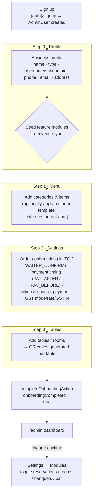

# Onboarding

When a new operator signs up, they are routed into a short setup wizard before
reaching the dashboard. The wizard is driven by the venue's `OnboardingConfig`
record: `onboardingStep` tracks progress and `onboardingCompleted` gates entry to
`/admin`. The step order lives in `src/lib/onboarding/steps.ts`:

```
profile → menu → settings → tables → done
```

(The "done" step simply finishes onboarding and redirects to `/admin`.) The
feature **modules** a venue uses are **seeded automatically from the venue type**
at the profile step — there is no separate "features" wizard screen — and can be
changed afterwards in **Settings → Modules**.

---

## Wizard flowchart



---

## Step-by-step

### Sign up
A new `AdminUser` (default role `OWNER`) is created with no restaurant yet. The
onboarding page (`src/app/onboarding/page.tsx`) detects the absent `restaurantId`
and shows the **Profile** step.

### Step 0 — Profile (`saveProfileAction`)
Collects and creates the `Restaurant` + its `OnboardingConfig`, links the owner,
and re-issues the session with the new `restaurantId`. Fields:

- **Business name**
- **Type** — Restaurant / Café / Hotel / Cloud kitchen / Bar (`RestaurantType`)
- **Username (subdomain)** — validated live (`checkSubdomainAction`): 3–30 chars,
  `a–z 0–9 -`, must start/end alphanumeric, not a reserved word, unique across the
  platform. Becomes the public address `username.<platform-domain>` (default
  domain `scan.to`, overridable via `NEXT_PUBLIC_PLATFORM_DOMAIN`).
- **Phone**, **contact email**, **address / city / state / PIN**

On save, the **feature modules are defaulted from the venue type** (see below) and
the wizard advances to Menu.

### Step 1 — Menu (`addCategoryAction`, `addMenuItemAction`)
Add menu **categories** and **items** (name, price, description, image, veg flag,
availability, special-of-day). Starter **menu templates** can be applied to
pre-populate categories + items (`applyTemplateAction` / `src/lib/templates.ts`):

- **cafe** — hot/cold beverages, quick bites, desserts
- **restaurant** — starters, mains, breads & rice, desserts
- **bar** — cocktails, mocktails, snacks

### Step 2 — Settings (`saveSettingsAction`)
Writes runtime behaviour to `OnboardingConfig`:

- **Order confirmation** — `AUTO` (straight to kitchen) vs `WAITER_CONFIRM`
- **Payment timing** — `PAY_AFTER` (request bill at end) vs `PAY_BEFORE` (pay at order)
- **Online payment** (Razorpay) and/or **pay at counter** toggles
- **GST** — mode `NONE` / `INCLUSIVE` / `EXCLUSIVE`, rate %, and GSTIN

(UPI, per-restaurant Razorpay/WhatsApp credentials, languages, happy hour and the
KOT printer are configured later in the full **Settings** page, not in this
wizard step.)

### Step 3 — Tables (`addTableAction`)
Add **tables** (or **rooms**, `kind = ROOM`, for hotel in-room dining) with a
label and seat count. A unique `qrToken` is generated per table, and the wizard
renders the scannable **QR code** + shareable URL for each.

### Done (`completeOnboardingAction`)
Sets `onboardingCompleted = true` and redirects to `/admin`.

---

## Per-venue-type feature defaults

At the profile step, modules are seeded from the chosen `RestaurantType` (then
editable in Settings). Logic from `src/lib/onboarding/actions.ts`:

| Venue type | `featureReservations` | `featureRooms` | `featureBanquets` | `featureBar` | `pickupEnabled` / `deliveryEnabled` | `requireDinerLocation` |
|------------|:--:|:--:|:--:|:--:|:--:|:--:|
| **RESTAURANT** | ✓ | — | — | — | — | ✓ |
| **CAFE** | ✓ | — | — | — | — | ✓ |
| **HOTEL** | ✓ | ✓ | ✓ | — | — | ✓ |
| **BAR** | ✓ | — | — | ✓ | — | ✓ |
| **QSR** | — | — | — | — | — | ✓ |
| **CLOUD_KITCHEN** | — | — | — | — | ✓ | — |
| **BAKERY** | — | — | — | — | ✓ | ✓ |
| **PIZZERIA** | ✓ | — | — | — | — | ✓ |
| **BURGER_JOINT** | ✓ | — | — | — | — | ✓ |
| **OTHER** | ✓ | — | — | — | — | ✓ |

Rule: `featureReservations` defaults on for every type **except** CLOUD_KITCHEN,
QSR and BAKERY (all three are counter/takeaway-first by nature); `featureRooms`
and `featureBanquets` default on for **HOTEL**; `featureBar` defaults on for
**BAR**. `pickupEnabled`/`deliveryEnabled` default on for CLOUD_KITCHEN and
BAKERY (takeaway-first venues); `requireDinerLocation` (the anti-fake-order
on-site check) defaults on for every type **except** CLOUD_KITCHEN — a bakery
is still a physical venue diners walk into, so unlike a cloud kitchen it keeps
the location check even though it shares the same pickup/delivery defaults.

These flags gate the admin navigation (Reservations / Rooms / Banquets entries)
— see the [nav permission/feature table in ARCHITECTURE.md](ARCHITECTURE.md#rbac--permission-model).

---

## Changing modules later

The defaults are only a starting point. An owner/manager can turn modules on or
off anytime under **Settings → Modules** (`src/app/admin/settings/`), which
updates the same `featureReservations` / `featureRooms` / `featureBanquets` /
`featureBar` flags on `OnboardingConfig`. Toggling a module immediately shows or
hides its admin section. The same Settings page also exposes UPI scan-to-pay
credentials, per-restaurant Razorpay keys, WhatsApp sender, menu languages, happy
hour, the KOT printer host/port, and the custom domain.
