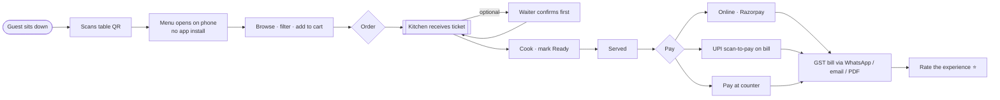
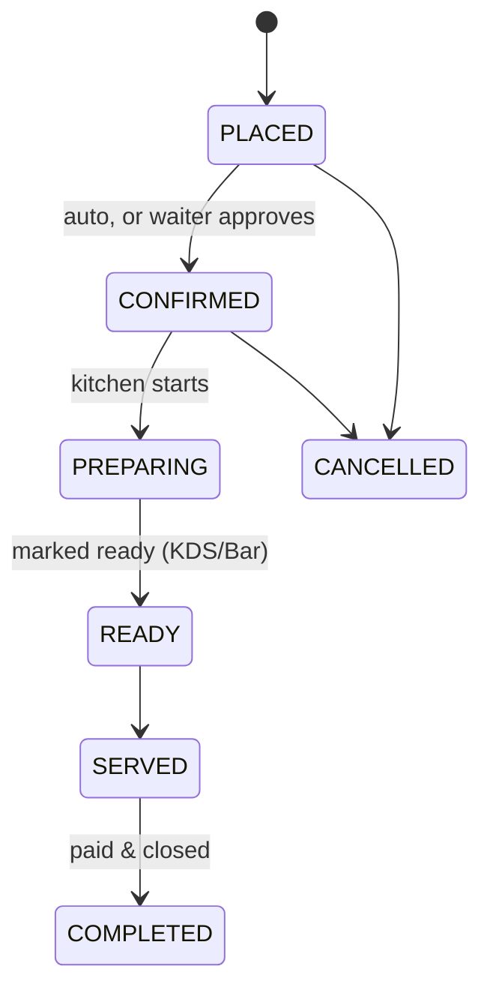
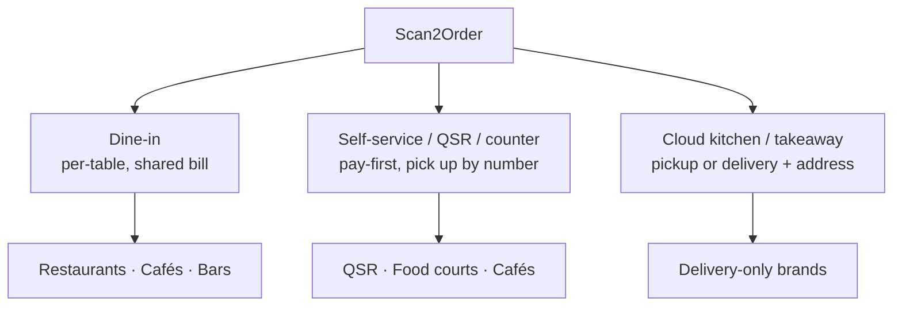
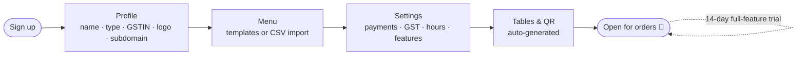
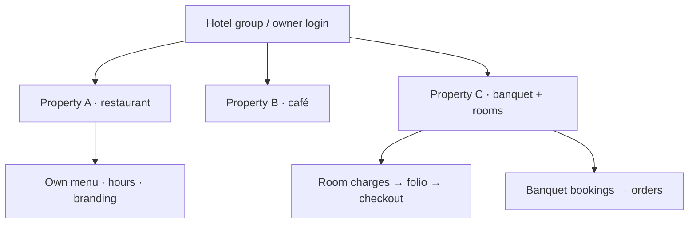
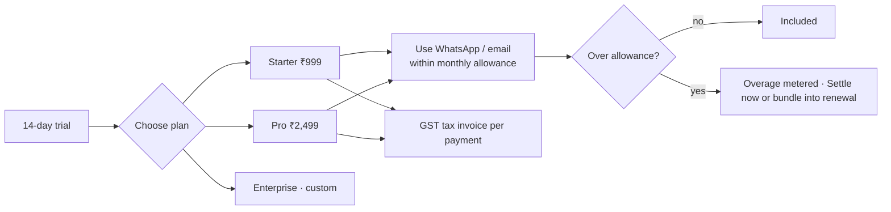
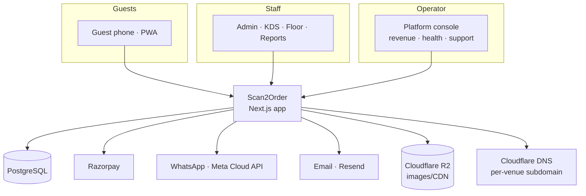

# Scan2Order — How It Works (Visual Flows)

Diagrams render automatically on GitHub and in any Mermaid-aware viewer
(VS Code, Obsidian, etc.). Use these in demos to show the journeys end-to-end.

---

## 1. The guest journey — scan to order to pay



## 2. Order lifecycle (what staff sees)



## 3. Service models (one product, every format)



## 4. Payment & settlement

```mermaid
sequenceDiagram
    participant G as Guest
    participant App as Scan2Order
    participant RZP as Razorpay
    participant K as Kitchen/Staff
    G->>App: Place order
    App->>K: Ticket (or hold for waiter)
    G->>App: Pay online
    App->>RZP: Create payment
    RZP-->>App: Captured (verified + webhook)
    App-->>G: GST bill (WhatsApp / email / PDF)
    Note over App,K: Table bill settles; table frees up
```

## 5. Owner onboarding (live in minutes)



## 6. Hotel / multi-property shape



## 7. Subscription, usage & billing



## 8. System at a glance (architecture)


